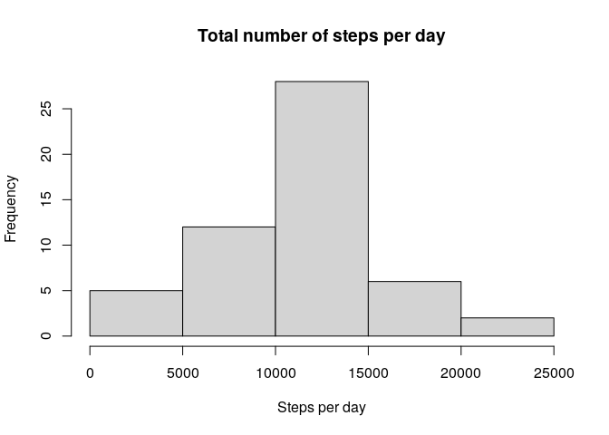
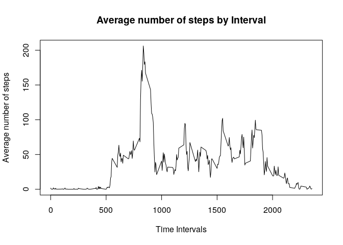
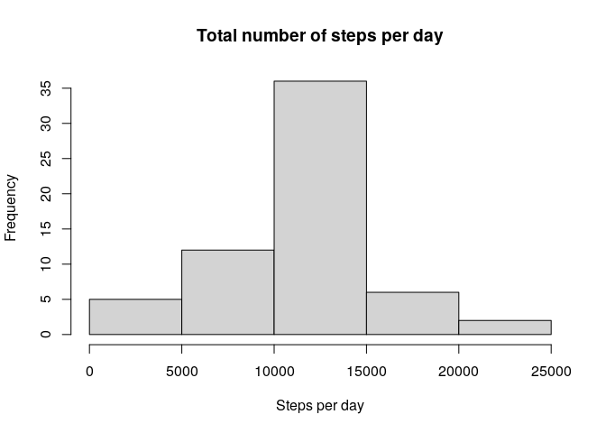
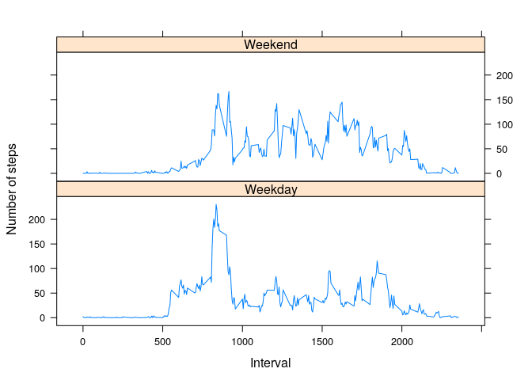

These are the steps taken to complete the project:


```r
library(knitr)
opts_chunk$set(echo = TRUE)
Sys.setlocale("LC_TIME", "C")
```

```
## [1] "C"
```

# Loading the packages to use

```r
library(dplyr)
```

```
## 
## Attaching package: 'dplyr'
```

```
## The following objects are masked from 'package:stats':
## 
##     filter, lag
```

```
## The following objects are masked from 'package:base':
## 
##     intersect, setdiff, setequal, union
```

```r
library(lubridate)
```

```
## 
## Attaching package: 'lubridate'
```

```
## The following objects are masked from 'package:base':
## 
##     date, intersect, setdiff, union
```

```r
library(ggplot2)
library(lattice)
```

## Downloading the zip file

```r
## If the zip file doesn't exist it's downloaded
filename <- "activity.zip"
if (!file.exists(filename)){
  fileURL <- "https://d396qusza40orc.cloudfront.net/repdata%2Fdata%2Factivity.zip"
  download.file(fileURL,filename)
}
```


```r
## If the data file doesn't exist it is uncompressed
if (!file.exists("activity.csv")){
  unzip(filename)
}
```

# Loading and preprocessing the data

# Loading the data into a dataframe

```r
##The data is loaded using the read.csv()
data <- read.csv("activity.csv", header = TRUE, sep = ',', colClasses = c("numeric", "character", "integer"))
```
# Process/transform the data into a suitable format

```r
##Changing the date column to date format:
data$date <- ymd(data$date)
```

# Verifying the data:

```r
str(data)
```

```
## 'data.frame':	17568 obs. of  3 variables:
##  $ steps   : num  NA NA NA NA NA NA NA NA NA NA ...
##  $ date    : Date, format: "2012-10-01" "2012-10-01" ...
##  $ interval: int  0 5 10 15 20 25 30 35 40 45 ...
```

```r
head(data)
```

```
##   steps       date interval
## 1    NA 2012-10-01        0
## 2    NA 2012-10-01        5
## 3    NA 2012-10-01       10
## 4    NA 2012-10-01       15
## 5    NA 2012-10-01       20
## 6    NA 2012-10-01       25
```

# What is mean total number of steps taken per day?
For this part of the assignment the missing values can be ignored.

1. Make a histogram of the total number of steps taken each day.
2. Calculate and report the mean and median of the total number of steps taken per day.

# step by step results:

Totalizing the number of steps by day:


```r
steps <- data %>%
  filter(!is.na(steps)) %>%
  group_by(date) %>%
  summarize(steps = sum(steps)) %>%
  print
```

```
## `summarise()` ungrouping output (override with `.groups` argument)
```

```
## # A tibble: 53 x 2
##    date       steps
##    <date>     <dbl>
##  1 2012-10-02   126
##  2 2012-10-03 11352
##  3 2012-10-04 12116
##  4 2012-10-05 13294
##  5 2012-10-06 15420
##  6 2012-10-07 11015
##  7 2012-10-09 12811
##  8 2012-10-10  9900
##  9 2012-10-11 10304
## 10 2012-10-12 17382
## # … with 43 more rows
```

Building the histogram:


```r
hist(steps$steps, main = "Total number of steps per day", xlab = "Steps per day")
```

<!-- -->

3. Calculate the mean and median of the total number of steps taken per day:


```r
mean_steps <- round(mean(steps$steps, na.rm = TRUE))
median_steps <- round(median(steps$steps, na.rm = TRUE))
mean_steps
```

```
## [1] 10766
```

```r
median_steps
```

```
## [1] 10765
```


# What is the average daily activity pattern?
1. Make a time series plot (i.e. type = "l") of the 5-minute interval (x-axis) and the average number of steps taken, averaged across all days (y-axis).
2. Which 5-minute interval, on average across all the days in the dataset, contains the maximum number of steps?.
# step by step results:

1.Calculate and plot the average number of steps per interval for all days


```r
avg_Steps_per_interval <- aggregate(steps ~ interval, data, mean)
```

Plot the series:


```r
plot(avg_Steps_per_interval$interval, avg_Steps_per_interval$steps, type='l', col=1, main="Average number of steps by Interval", xlab="Time Intervals", ylab="Average number of steps")
```

<!-- -->

2. Finding the 5-minute interval that contains the maximum number of steps:


```r
avg_Steps_per_interval[which.max(avg_Steps_per_interval$steps),][,1]
```

```
## [1] 835
```


# Imputing missing values
Note that there are a number of days/intervals where there are missing values (coded as NA). The presence of missing days may introduce bias into some calculations or summaries of the data.

1. Calculate and report the total number of missing values in the dataset (i.e. the total number of rows with NAs).
2. Devise a strategy for filling in all of the missing values in the dataset. The strategy does not need to be sophisticated. For example, you could use the mean/median for that day, or the mean for that 5-minute interval, etc.
3. Create a new dataset that is equal to the original dataset but with the missing data filled in.
4. Make a histogram of the total number of steps taken each day and calculate and report the mean and median total number of steps taken per day. Do these values differ from the estimates from the first part of the assignment? What is the impact of imputing missing data on the estimates of the total daily number of steps?
# step by step results:

1. Summarize all the missing values:

```r
sum(is.na(data$steps))
```

```
## [1] 2304
```

2. Strategy: Substitute the NA value with the average value for that activity.
3. Creating the clean dataset:

```r
for (i in 1:nrow(data)) {
    if(is.na(data$steps[i])) {
        val <- avg_Steps_per_interval$steps[which(avg_Steps_per_interval$interval == data$interval[i])]
        data$steps[i] <- val 
    }
}
```

Check that there are no missing values:

```r
sum(is.na(data$steps))
```

```
## [1] 0
```

4. Calculate and display the number of steps taken in each 5-minute interval per day: 

```r
steps_full <- data %>%
  group_by(date) %>%
  summarize(steps = sum(steps)) %>%
  print
```

```
## `summarise()` ungrouping output (override with `.groups` argument)
```

```
## # A tibble: 61 x 2
##    date        steps
##    <date>      <dbl>
##  1 2012-10-01 10766.
##  2 2012-10-02   126 
##  3 2012-10-03 11352 
##  4 2012-10-04 12116 
##  5 2012-10-05 13294 
##  6 2012-10-06 15420 
##  7 2012-10-07 11015 
##  8 2012-10-08 10766.
##  9 2012-10-09 12811 
## 10 2012-10-10  9900 
## # … with 51 more rows
```


```r
hist(steps_full$steps, main = "Total number of steps per day", xlab = "Steps per day")
```

<!-- -->

# Extract and display the mean and median with the new values:


```r
mean_steps_full <- round(mean(steps_full$steps, na.rm = TRUE))
median_steps_full <- round(median(steps_full$steps, na.rm = TRUE))
mean_steps_full
```

```
## [1] 10766
```

```r
median_steps_full
```

```
## [1] 10766
```


# Are there differences in activity patterns between weekdays and weekends?
For this part the weekdays() will come handy. Use the dataset with the filled-in missing values for this part.

1. Create a new factor variable in the dataset with two levels - “weekday” and “weekend” indicating whether a given date is a weekday or weekend day.
2. Make a panel plot containing a time series plot (i.e. type = "l") of the 5-minute interval (x-axis) and the average number of steps taken, averaged across all weekday days or weekend days (y-axis).
# step by step results:

1.Create a new column, day_type, and apply a function to determine whether the day is weekend or weekday:

```r
day <- weekdays(as.Date(data$date))
daylevel <- vector()
for (i in 1:nrow(data)) {
    if (day[i] == "Saturday") {
        daylevel[i] <- "Weekend"
    } else if (day[i] == "Sunday") {
        daylevel[i] <- "Weekend"
    } else {
        daylevel[i] <- "Weekday"
    }
}
```


```r
data$daylevel <- daylevel
data$daylevel <- factor(data$daylevel)
```

2. Calculate the average steps in the 5-minute interval and display the differences:
Separating weekdays and weekends:

```r
stepsByDay <- aggregate(steps ~ interval + daylevel, data = data, mean)
names(stepsByDay) <- c("interval", "daylevel", "steps")
```

Displaying the differences:

```r
xyplot(steps ~ interval | daylevel, stepsByDay, type = "l", layout = c(1, 2), 
    xlab = "Interval", ylab = "Number of steps")
```

<!-- -->
